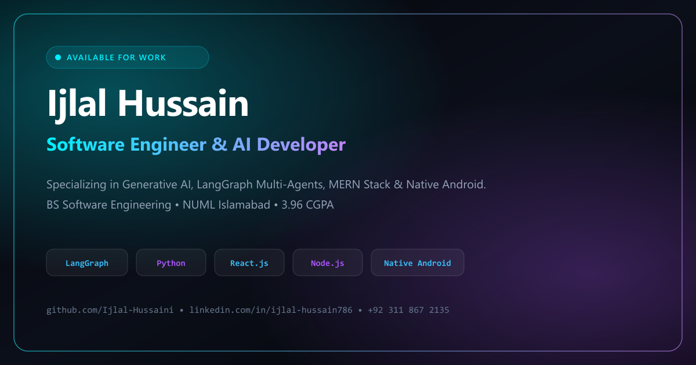
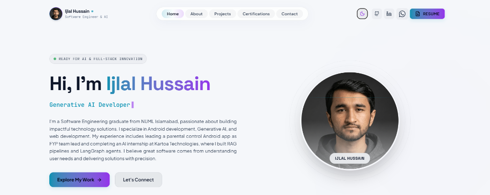
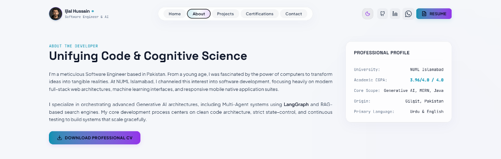
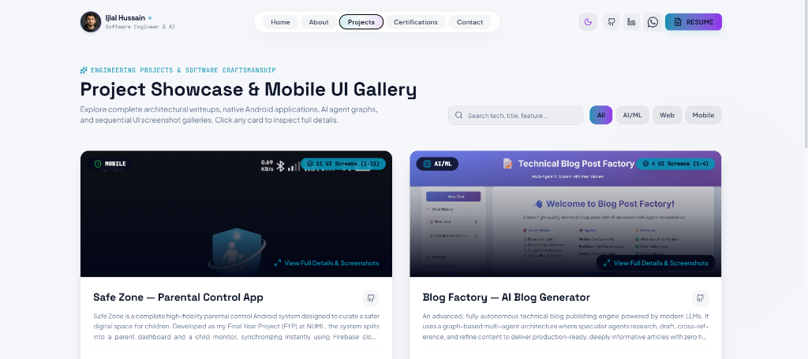
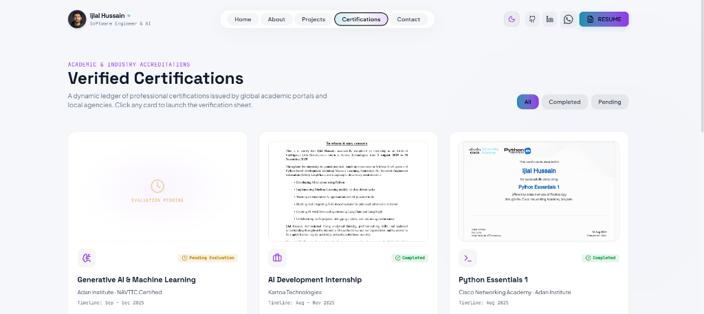
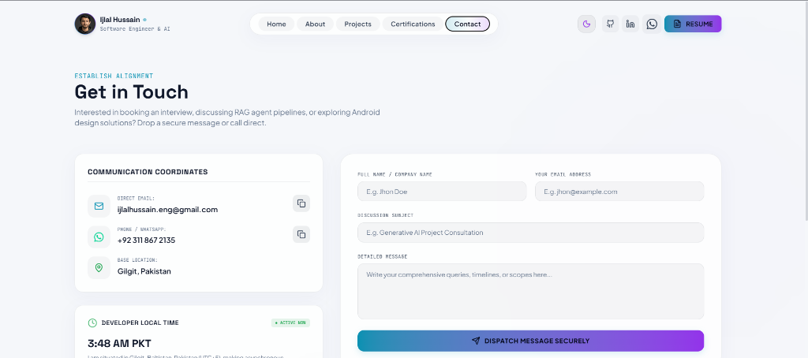

<div align="center">
  

  <br/><br/>

  # ⚡ Ijlal Hussain — Software Engineer & AI Developer
  
  <p align="center">
    <b>High-Performance Portfolio | Generative AI • LangGraph Multi-Agents • Full-Stack Web • Native Android</b>
  </p>

  <p align="center">
    <a href="https://ijlalhussain.vercel.app/"></a>
    <a href="https://linkedin.com/in/ijlal-hussain786"></a>
    <a href="mailto:ijlalhussain.eng@gmail.com"></a>
    <a href="https://wa.me/923118672135"></a>
  </p>

  <p align="center">
    
    
    
    
    
    
    
  </p>
</div>

---

## 🌐 Live Production Deployment

> **Experience the live website:**  
> 👉 **[https://ijlalhussain.vercel.app/](https://ijlalhussain.vercel.app/)**

---

## 📸 Portfolio UI Showcase & Screenshots

### 1. Home / Hero Stage
> *Features dynamic typewriter intro, holographic neon profile framing, key technical pillars, and quick work showcase.*

<div align="center">
  
</div>

---

### 2. About the Developer
> *Interactive career journey, employment timeline, academic ascent (NUML BS Software Engineering, 3.96 CGPA), and categorized skillset pills.*

<div align="center">
  
</div>

---

### 3. Projects Showcase & Mobile UI Gallery
> *Category filtering (AI/ML, Web, Mobile), live search, multi-screen sequence lightbox, and architectural deep-dive modals.*

<div align="center">
  
</div>

---

### 4. Verified Credentials Ledger
> *Dynamic ledger of certified academic and industrial achievements with instant full-screen inspection and PDF certificate downloads.*

<div align="center">
  
</div>

---

### 5. Direct Communications & Live Gateway
> *Asynchronous real-time message dispatch to `ijlalhussain.eng@gmail.com`, live PKT time ticker, 1-click clipboard copying, and direct WhatsApp channel.*

<div align="center">
  
</div>

---

## 🌟 Key Features & Architectural Highlights

- ⚡ **Ultra-Fast Performance**: Zero render-blocking CSS, WebP next-gen compression, and critical asset preloading for instant page loads.
- 🎨 **Adaptive Glassmorphic Design**: Sleek cosmic dark theme (`#05050a`) and crisp light theme with instant toggle and persistent theme caching.
- 📱 **Mobile-First Responsive Drawer**: Slide-out navigation drawer with blurred backdrop overlay and body scroll locking.
- 🔄 **URL Hash Routing & State Persistence**: Deep-linkable tabs (`/#about`, `/#projects`, `/#contact`) with full page persistence on browser refresh and Back/Forward history.
- 🔤 **Precision Typography & Justification**: Automatic hyphenation (`hyphens: auto`) and clean text justification across all descriptions and timeline items.
- 📬 **Live Email Gateway**: Direct client-side message dispatch powered by Web3Forms API with automatic mailto fallback.
- 📲 **Progressive Web App (PWA)**: Standalone installable app experience on Android, iOS, Windows, and macOS with web app manifest and asset caching.
- 🔍 **SEO & Social Optimization**: 1200×630px high-resolution OpenGraph banners, Twitter Card metadata, and semantic HTML5 layout.

---

## 🛠️ Tech Stack & Engineering Specifications

| Domain | Technologies |
|:---|:---|
| **Core Frontend** | React 19, TypeScript, Vite 6, Tailwind CSS v4, Motion (Framer Motion v12) |
| **Icons & Typography** | Lucide React, Plus Jakarta Sans, Space Grotesk, JetBrains Mono |
| **Generative AI & Agentic** | LangGraph, LangChain, RAG Pipelines, OpenAI API, LLM Fine-Tuning |
| **Full-Stack Web** | Node.js, Express.js, MongoDB, RESTful Architecture, Web3Forms API |
| **Mobile Development** | Native Android (Java), Flutter, MVVM Architecture, Room Database, Retrofit |
| **Deployment & CI/CD** | Vercel Global Edge CDN, Git / GitHub Repository |

---

## 📁 Repository Structure

```tree
ijlal-hussain-portfolio/
├── docs/
│   └── screenshots/               # High-resolution portfolio preview captures
│       ├── 01_home_view.png
│       ├── 02_about_view.png
│       ├── 03_projects_view.png
│       ├── 04_certifications_view.png
│       └── 05_contact_view.png
├── public/
│   ├── assets/
│   │   ├── certifications/        # Authentic vector certificate PDFs and thumbnails
│   │   ├── images/                # Next-gen WebP & PNG profile photos, OG preview
│   │   └── projects/              # Sequential project UI screenshots (1-11)
│   ├── icons/                     # PWA maskable application icons (192px, 512px)
│   ├── Ijlal_Hussain_CV.pdf       # Official resume document
│   └── manifest.json              # Web App Manifest specification
├── src/
│   ├── components/
│   │   ├── AboutView.tsx          # Career timeline, skills pills & bio
│   │   ├── CertificationsView.tsx # Verified credentials ledger & PDF viewer modal
│   │   ├── ContactView.tsx        # Live Web3Forms submission & local time ticker
│   │   ├── Footer.tsx             # Responsive footer with remote availability badge
│   │   ├── Header.tsx             # Navbar with theme toggle & mobile side drawer
│   │   ├── HomeView.tsx           # Hero stage, typewriter & feature pillars
│   │   ├── ProjectsView.tsx       # Searchable project gallery & sequence lightbox
│   │   └── WhatsAppIcon.tsx       # Custom SVG vector component
│   ├── data.ts                    # Single source of truth for portfolio content
│   ├── index.css                  # Theme tokens, glassmorphism & typography rules
│   ├── main.tsx                   # React root mount
│   └── vite-env.d.ts              # Vite environment types
├── index.html                     # HTML5 entry with preconnects, SEO & OpenGraph
├── vercel.json                    # Single Page Application rewrites for Vercel
├── package.json                   # Dependency definitions & scripts
└── README.md                      # Comprehensive repository documentation
```

---

## 🚀 Local Setup & Development

To run this portfolio locally on your machine:

```bash
# 1. Clone the repository
git clone https://github.com/Ijlal-Hussaini/ijlal-hussaini.github.io.git
cd ijlal-hussaini.github.io

# 2. Install project dependencies
npm install

# 3. Configure environment variables (optional for live email)
# Create a .env file with:
# VITE_WEB3FORMS_ACCESS_KEY="your-access-key"

# 4. Start local development server
npm run dev

# 5. Build for production
npm run build
```

---

## 📬 Contact Coordinates

- 🌐 **Live Website**: [ijlalhussain.vercel.app](https://ijlalhussain.vercel.app/)
- 📧 **Direct Email**: [ijlalhussain.eng@gmail.com](mailto:ijlalhussain.eng@gmail.com)
- 💼 **LinkedIn**: [linkedin.com/in/ijlal-hussain786](https://linkedin.com/in/ijlal-hussain786)
- 🐙 **GitHub**: [github.com/Ijlal-Hussaini](https://github.com/Ijlal-Hussaini)
- 💬 **WhatsApp**: [+92 311 867 2135](https://wa.me/923118672135)
- 📍 **Location**: Gilgit, Pakistan (Available for Global Remote Opportunities)

---

## 📄 License & Attribution

Distributed under the **MIT License**.  
Designed & Engineered with Precision © 2026 **[Ijlal Hussain](https://github.com/Ijlal-Hussaini)**.
